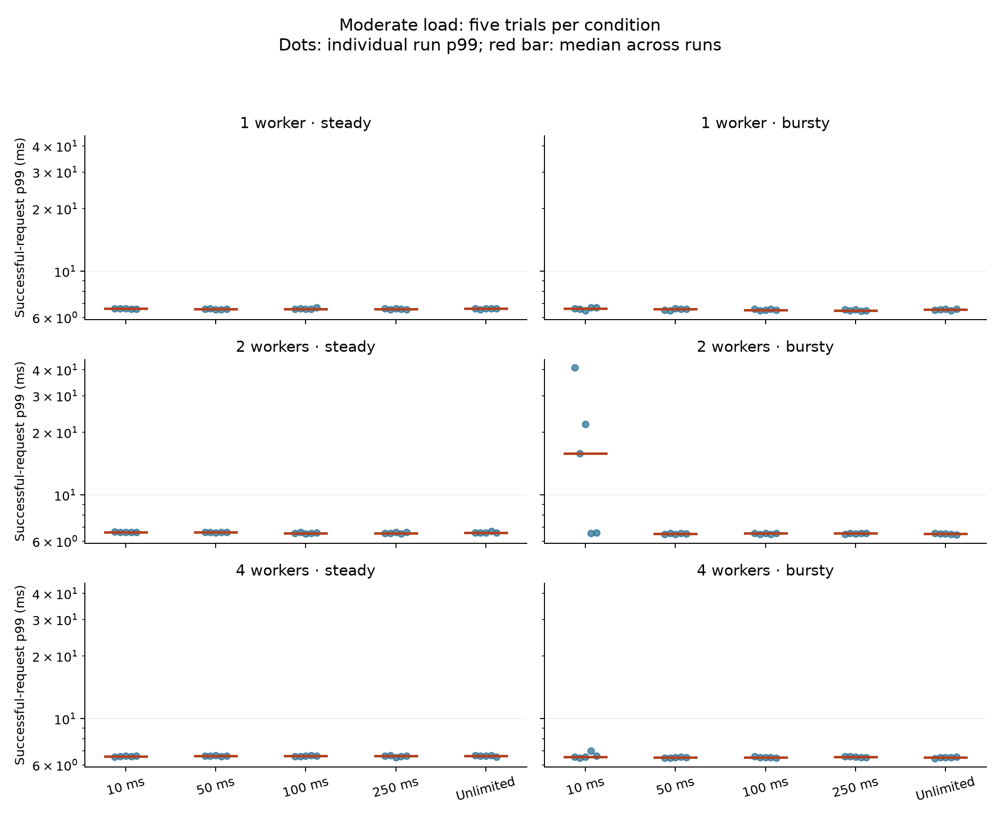
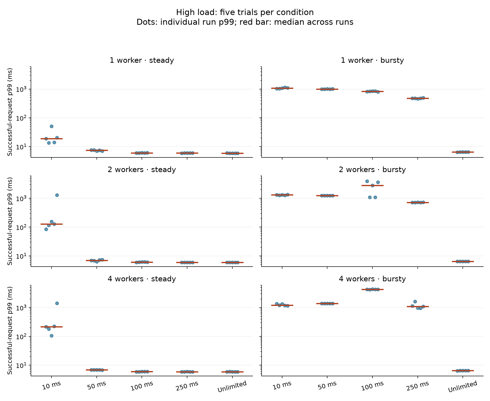
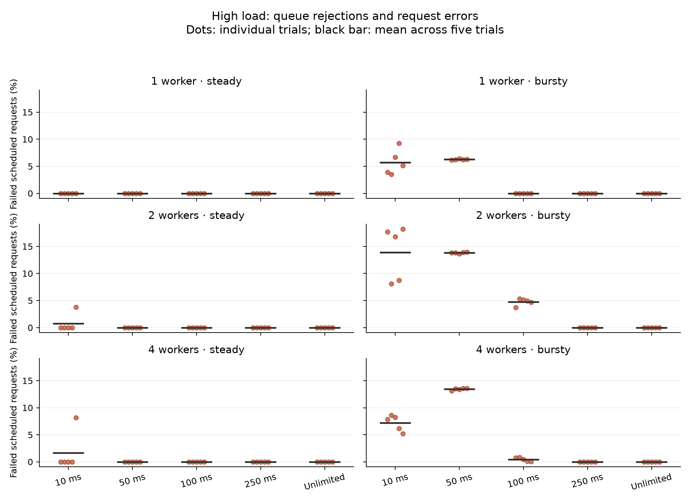
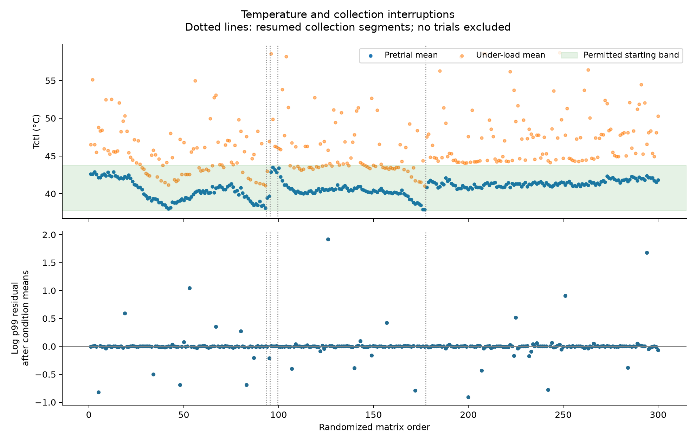

# CPU Quota Period, Worker Concurrency, and Tail Latency under Linux cgroup v2

> Completed-experiment draft based on session `20260921-202841` (300 trials).
> These results replace the legacy pilot claims. Related work, independent replication,
> and submission formatting remain to be completed. The earlier draft is preserved in
> [archive/paper_draft_legacy.md](archive/paper_draft_legacy.md).

## Abstract

An average CPU limit does not fully describe the latency experienced by a containerized
service. We evaluate four quota periods at a fixed nominal allocation of 0.5 CPU, together
with an unlimited comparison, on one Linux host. A randomized factorial experiment crosses
CPU configuration, one/two/four workers, two offered loads, and steady/bursty arrivals, with
five repetitions per condition (300 trials). At moderate load, most condition means of run
p99 latency are approximately 6–7 ms. At high steady load, the 10 ms period produces variable
tail inflation, particularly with multiple workers. At high bursty load, mean run p99 ranges
from 479 to 4303 ms across capped conditions, versus approximately 6.46 ms without a quota.
Increasing the period from 10 to 250 ms reduces high-burst p99 most clearly with one or two
workers; the relationship is not monotonic across all worker counts. We retain 23,059 queue
rejections and 17 request timeouts as outcomes and report latency conditional on success.
These observations support joint evaluation of quota period, concurrency, and arrivals,
with conclusions limited to the tested workload and host.

## 1. Research question and scope

Linux cgroup v2 exposes bandwidth control through `cpu.max`, specifying a quota and period.
For example, 5 ms per 10 ms and 50 ms per 100 ms both express a nominal 0.5-CPU limit. The
controller also exposes usage and throttling counters [1]. Runtime is distributed to CPU
run queues, and threads can be throttled when runtime is unavailable; the kernel documentation
describes allocation and hierarchy caveats [2].

We ask how quota period affects tail latency at the same nominal CPU fraction, how worker
count interacts with that effect, and how bursty arrivals change outcomes at the same mean
offered rate. The contribution is a reproducible measurement of these interactions for a
specific service, with raw requests, counters, environmental traces, and interruption records.
The unlimited configuration has greater available CPU bandwidth; it is not another 0.5-CPU
allocation. We make no claim of a universally optimal quota period.

## 2. Experimental methods

### 2.1 Host and service

The recorded host is an AMD Ryzen 5 5600H system with 12 logical CPUs, approximately 16 GB
RAM, Arch Linux, kernel `7.2.6-arch2-1`, Docker Engine `29.8.1`, and cgroup v2. Versions are
reported from session metadata. The service uses logical CPUs 2 and 4; the runner, generator,
and monitor use CPUs 0 and 1. This affinity separates their selected physical cores but does
not provide exclusive isolation: host processes and SMT siblings remain possible noise sources.

The Go HTTP service executes 44,000 SHA-256 iterations per request. A queue of capacity 128
feeds one, two, or four workers; a full queue causes HTTP 503. `GOMAXPROCS` is fixed at two,
so four workers do not imply four simultaneously executing CPUs. Each trial starts a fresh
container. Its quota, period, zero `cpu.max.burst`, affinity, and recorded ancestor limits
are verified.

### 2.2 Calibration and arrivals

Work is calibrated with cgroup CPU accounting toward approximately 5 ms per request; that
target does not guarantee constant cost across CPU frequencies and load conditions. Capacity
calibration uses one worker, a 100 ms period, and a 50 ms quota. Thirty-second windows and
three bracket refinements yield a lower stable reference of 133.19 requests/s and an upper
unstable point of 135.70. Common rates are then used throughout the matrix:

| Load | Mean requests/s | Burst low rate | Burst high rate |
| --- | ---: | ---: | ---: |
| Moderate | 66.59 | 33.295 | 99.885 |
| High | 113.21 | 56.605 | 169.815 |

Steady traffic uses the mean throughout. Bursty traffic alternates five seconds at each
rate. Its high-load peak exceeds the calibrated reference, deliberately allowing transient
overload. The reference capacity is specific to one configuration; “high” does not imply
the same utilization in every condition.

The custom generator schedules arrivals independently of previous completions, using 512
client workers, persistent connections within each phase, and a five-second HTTP timeout.
It records dispatch delay, status, and scheduled-to-completion latency including body reading.
The independent schedule and recorded lateness make delays in generating traffic visible.

### 2.3 Matrix and environment

Five CPU configurations (10, 50, 100, and 250 ms periods at 0.5 CPU, plus unlimited), three
worker counts, two loads, and two patterns form 60 conditions. Five repetitions produce
300 trials in a fixed shuffled order (Python random seed 42). Each has 20 seconds of warm-up
and 60 seconds of scheduled measurement arrivals, followed by request drain before final
accounting. Repetitions share one machine. Saturation checks observe 0.4986–0.5013 CPU cores
across capped periods; pilot checks verify instrumentation and unlimited own throttling.

The initial `k10temp:Tctl` baseline is 40.77°C. Before every trial, the last full minute must
average within ±3°C, vary by no more than 2°C, and have an absolute fitted trend no greater
than 1°C/minute. Resume requires at least ten minutes of settling. These are starting-condition
rules, not hardware safety thresholds. Power settings are checked at boundaries and during
measurement. Under-load temperature and frequency traces are retained as observations.

Collection spans September 21–25, 2026, in five segments: trials 1–93, 94–95, 96–99, 100–177,
and 178–300. Four archived failed trial attempts produced no complete matrix result; 22
resume-settling attempts are recorded, including attempts without subsequent measurements.
An explicit inventory amendment before trial 94 adds an offline USB-C supply entry while
retaining the required online AC supply. Every completed matrix observation is retained.

### 2.4 Endpoints and analysis

The primary endpoint is each trial's nearest-rank p99 among successful requests, measured
from scheduled arrival to completion. Tables show arithmetic means of five run p99 values,
not a pooled request percentile. Figures show every repetition and the median across runs.
Rejections and timeouts are separate outcomes; successful-request p99 is not a reliability
measure for all offered requests.

A separate audit recalculates p50, p95, and p99 from raw requests and reconciles saved
reports and the summary table. It checks request accounting, matrix/configuration matches,
cgroup limits and counter deltas, power consistency, accepted starting conditions, monitoring,
and original source/binary hashes. No discrepancies were found. Internal consistency does
not establish absence of all measurement bias.

Exploratory Welch tests [3] on log(run p99) give geometric-mean ratios and pointwise 95% intervals.
We consider 62 contrasts: twelve 250/10 ms, twenty four/one worker, and thirty bursty/steady
comparisons. P values receive a joint Holm correction [4]; intervals are unadjusted. These
contrasts were chosen during analysis, not preregistered. Repetition labels are not treated
as paired observations. Five trials per cell limit assessment of distributions and rare events.

A post hoc sensitivity model includes separate means for all 60 conditions, collection
segment, and starting temperature, with HC3 standard errors [5]. A separate model checks linear
trial-order drift. Under-load temperature is not adjusted away because it may be caused by
the workload. The original automatic regression remains exploratory; its high R-squared
does not establish a causal mechanism.

## 3. Results

### 3.1 Completion and failures

All 300 trials completed without recorded instrumentation flags. Of 1,618,350 scheduled
requests, 1,595,274 succeeded, 23,059 received HTTP 503, and 17 recorded client timeouts while
awaiting headers. There were no generator client drops or missed arrivals. The largest run
dispatch-lag p99 was 1.095 ms, below the declared 2 ms gate. Every trial has 58–60 monitor
samples. Unlimited trials have zero own cgroup throttling events.

### 3.2 Moderate load

Moderate steady condition means of run p99 span approximately 6.57–6.63 ms. Moderate bursty
means are approximately 6.50–6.64 ms except at 10 ms with two workers: mean 18.37 ms, with
individual runs spanning 6.54–40.92 ms. Moderate trials record no rejections or errors. Small
differences among the remaining conditions do not justify broad operational recommendations.



### 3.3 High steady traffic

Mean run p99 (ms), five repetitions per cell:

| Quota period | 1 worker | 2 workers | 4 workers |
| --- | ---: | ---: | ---: |
| 10 ms | 23.65 | 355.77 | 429.83 |
| 50 ms | 7.35 | 6.97 | 6.88 |
| 100 ms | 6.06 | 6.09 | 5.98 |
| 250 ms | 5.97 | 5.95 | 5.92 |
| Unlimited | 5.93 | 5.93 | 5.94 |

At 10 ms, the two-worker median run p99 is 127.96 ms but one run reaches 1296.25 ms; with
four workers the median is 215.01 ms and maximum 1423.29 ms. Those two extreme runs contain
all 810 high-steady queue rejections. All observations remain in the analysis. Mean
throttled-period fractions at 10 ms are 63.3%, 89.1%, and 91.0% for one, two, and four workers;
at 250 ms they are 6.7%, 4.7%, and 4.5%. This counter ratio is not the fraction of requests
throttled or the fraction of wall-clock time stalled.

### 3.4 High bursty traffic

Mean run p99 (ms), five repetitions per cell:

| Quota period | 1 worker | 2 workers | 4 workers |
| --- | ---: | ---: | ---: |
| 10 ms | 1075.01 | 1306.87 | 1248.33 |
| 50 ms | 1005.99 | 1246.51 | 1382.65 |
| 100 ms | 828.76 | 2500.33 | 4302.71 |
| 250 ms | 478.78 | 722.37 | 1157.63 |
| Unlimited | 6.46 | 6.45 | 6.46 |



With one worker, 250 versus 10 ms reduces geometric-mean run p99 by 55.4% (ratio 0.446;
pointwise 95% interval 0.425–0.467); with two workers the reduction is 44.7% (ratio 0.553;
interval 0.534–0.572). Both Holm-adjusted p values are below 0.00001. With four workers the
ratio is 0.912 (0.704–1.180), so a consistent advantage is not established. The 100 ms/four-worker
cell is worst, with mean 4302.71 ms and range 4220.35–4353.54 ms. The 100 ms/two-worker
cell is much more variable, spanning 1082.12–3903.52 ms.

Failed requests as a percentage of all scheduled high-bursty requests, summed over five
trials (33,965 requests per cell):

| Quota period | 1 worker | 2 workers | 4 workers |
| --- | ---: | ---: | ---: |
| 10 ms | 5.71% | 13.90% | 7.22% |
| 50 ms | 6.26% | 13.82% | 13.43% |
| 100 ms | 0.00% | 4.77% | 0.44% |
| 250 ms | 0.00% | 0.00% | 0.00% |
| Unlimited | 0.00% | 0.00% | 0.00% |



All 17 timeouts occur at 100 ms with two or four workers. Higher rejection can change which
requests contribute to successful latency, so latency and failures must be interpreted
together. For example, the 100 ms/four-worker condition has worse successful-request tails
but fewer failures than 50 ms/four-worker. We do not combine these outcomes into a single
service-quality ranking.

### 3.5 Repeatability and interruption sensitivity

Six of 60 conditions have a run-p99 coefficient of variation above 10%, a descriptive
screen used during analysis. The detailed report lists them and retains every repetition.
The pretrial means span 37.89–43.49°C; the maximum under-load Tctl sample is 61.875°C.
Passing the starting-temperature gate does not force identical temperatures during work.



Adjusting for segment and starting temperature changes standardized condition geometric
means by −1.59% to +2.90%. The last-segment multiplier relative to the first is 0.993 (95%
interval 0.919–1.072). The separate order model gives 1.013 per 100 trials (p=0.523). These
checks show no clear overall shift, but do not establish equivalence across resumptions
or rule out condition-specific confounding. Segments with two and four trials provide
particularly limited independent information.

## 4. Interpretation and limitations

Quota-period effects depend on load and concurrency. Most moderate conditions have similar
latency. High steady traffic exposes occasional severe delay at the shortest period, while
high bursty traffic produces substantial tails under every quota and a strong worker-count
interaction. The findings are consistent with runtime constraints and finite-queue behavior
during arrival peaks. They do not isolate the contributions of CPU-local allocation, Go
scheduling, queue occupancy, or timeout handling. Queue-depth and scheduler traces are
needed to explain the unusually poor 100 ms multi-worker conditions directly.

For this service, 250 ms with one worker has the lowest observed high-bursty tail among
capped conditions and no failed requests. The non-monotonic multi-worker results prevent
a universal recommendation to increase periods or worker counts. The legacy draft's claim
that longer periods eliminate quota-induced tail latency is not supported by this dataset.

Limits on interpretation include:

- One physical host and a synthetic service with a fixed queue and runtime parallelism;
  results do not directly generalize to Kubernetes, other applications, or other hardware.
- Five repetitions per cell on a shared machine, leaving uncertainty about rare events
  and dependence between trials despite randomization and settling.
- Affinity without exclusive isolation. Background applications appear in process snapshots;
  adaptive CPU frequencies, host activity, and interrupted collection remain possible
  influences. Temperature checks do not establish absence of thermal throttling.
- Short capacity calibration on one reference configuration, with deliberately over-capacity
  burst peaks. The same offered rate need not imply the same utilization across conditions.
- Successful-request latency excludes rejections and five-second timeouts. Queued service
  work can continue after a client times out. Failures must accompany latency in reporting.
- Exploratory statistical choices and limited distributional evidence. Holm adjustment
  covers the specified test family, not all analysis choices or external generalization.

Before submission, complete related work and independently repeat the variable 10 ms
high-steady cells, the 10 ms/two-worker moderate-bursty cell, and the extreme 100/250 ms
multi-worker high-bursty cells. New instrumentation or baseline choices require a separate
session with its own provenance. Mechanism-focused work should capture queue occupancy
and scheduler events.

## 5. Conclusion

The 300-trial experiment shows that the same nominal CPU fraction can produce different
tail latency depending on period, worker count, and arrivals. High bursty traffic produces
the largest delays; moderate traffic is mostly insensitive. The evidence supports joint
evaluation of these controls and reporting both successful latency and failures. It does
not establish a universally preferred quota period or benefit from additional workers.

## Artifact and reproduction

The dataset is `results/sessions/20260921-202841/`; `source/` and `metadata.json` preserve
experiment provenance. The completed-data backup is Git commit `80612a8`. Original automatic
outputs remain in `processed/`. Reproduce the review from the repository root:

```bash
venv/bin/python analysis/review_completed.py results/sessions/20260921-202841
```

The review writes tables, raw-file hashes, audit results, exploratory contrasts, sensitivity
models, and figures to `processed/review/`. See [the detailed report](../results/sessions/20260921-202841/processed/review/interpretation.md)
for definitions, all-cell summaries, and variability details.

## References

1. Linux kernel documentation. [Control Group v2: CPU interface](https://docs.kernel.org/admin-guide/cgroup-v2.html#cpu).
2. Linux kernel documentation. [CFS Bandwidth Control](https://docs.kernel.org/scheduler/sched-bwc.html).
3. SciPy documentation. [Independent-sample t tests, including Welch's test](https://docs.scipy.org/doc/scipy/reference/generated/scipy.stats.ttest_ind.html).
4. statsmodels documentation. [Multiple-testing correction methods](https://www.statsmodels.org/stable/generated/statsmodels.stats.multitest.multipletests.html).
5. statsmodels documentation. [Robust covariance estimation for OLS](https://www.statsmodels.org/stable/generated/statsmodels.regression.linear_model.OLSResults.get_robustcov_results.html).
